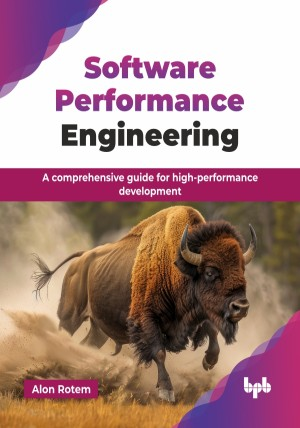

# Software Performance Engineering

A comprehensive guide for high-performance development.

This is the repository for [Software Performance Engineering
](https://bpbonline.com/products/software-performance-engineering?variant=44647893500104),published by BPB Publications.

## About the Book
This book introduces the concept of Software Performance Engineering throughout the development process. Software performance yields from a wide range of factors: from hardware through coding standards, runtime frameworks, design patterns, quality assurance and testing, and system architectural patterns, to name a few. This book takes a holistic view of the entire software development lifecycle, learning each of its phases, to understand the technologies, techniques, and tools available, and how we can use them to improve the behavior and performance of our system.

Technical hands-on chapters introduce tools and libraries, showing practical examples of how to set them up and use them with ease, while theoretical chapters include comprehensive information and deep explanations of a broad selection of concepts, all accompanied by relevant charts, screenshots, and code samples.  Key sections cover performance monitoring design using tools like OpenTelemetry, detailed code profiling techniques, and best practices for performance testing and test data management. You will also learn about the performance benchmarking types, KPIs/metrics analysis, and behavioral correlation.

Upon completing this book, you will possess the practical skills to proactively integrate performance into every development stage, diagnose complex issues, and manage system performance effectively post-production. Code snippets are mainly written in Python, as the book focuses on current technologies, delving into concepts of cloud computing, design patterns, and best practices, in order to learn how to optimize the entire software delivery process, end-to-end.

## What You Will Learn
• Define performance requirements, metrics, and KPIs.

• Useful design patterns and bad practices to avoid.

• Utilize cloud services for performance.

• Tools for optimizing code and testing.

• Live telemetry, monitoring, measuring, dashboarding, and predicting.
